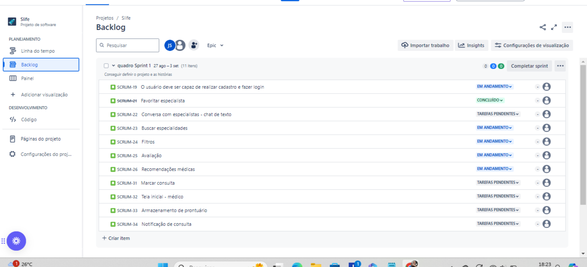
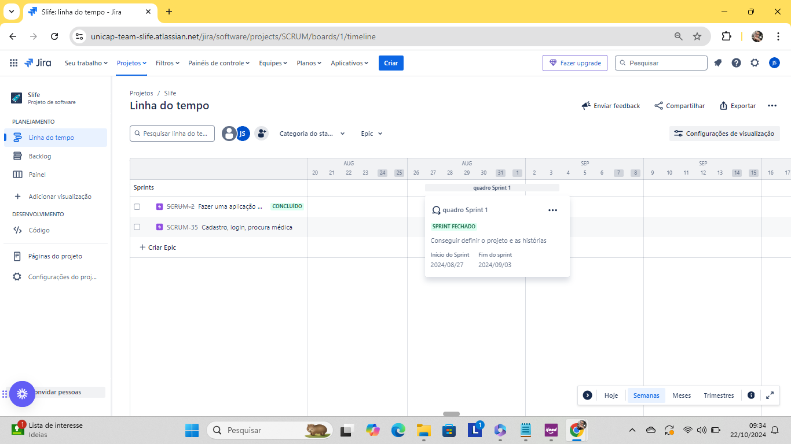
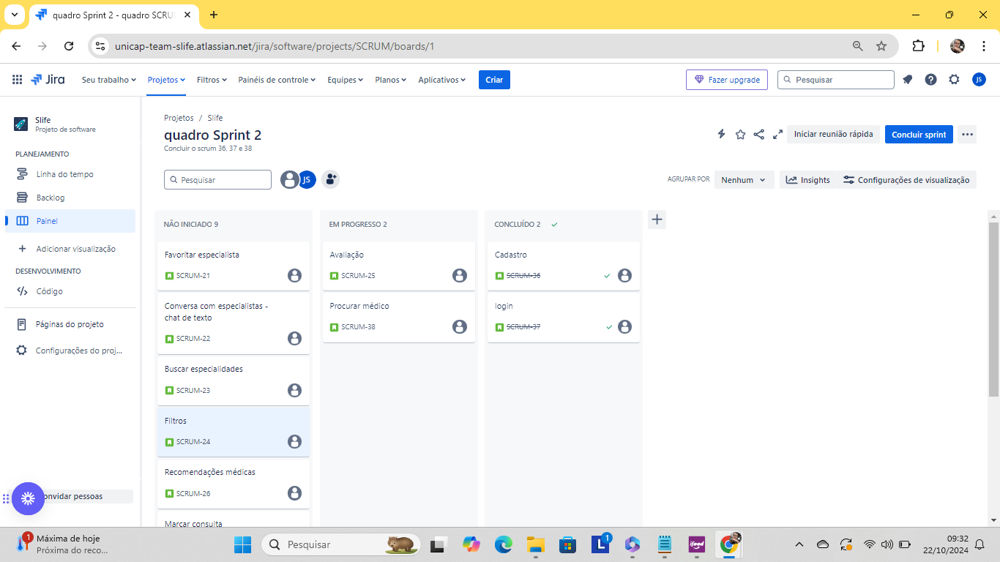
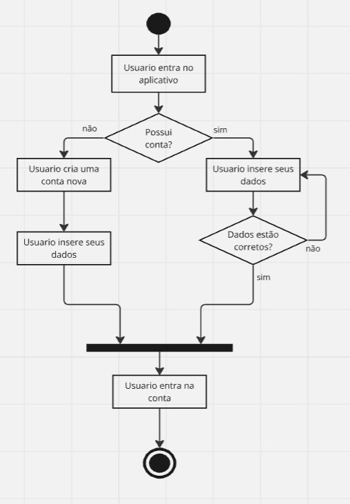
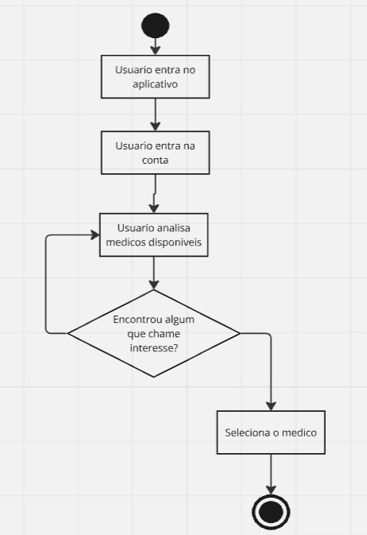
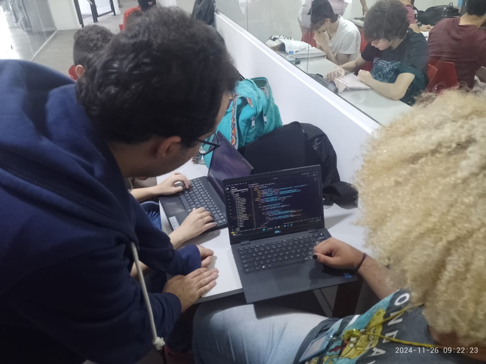
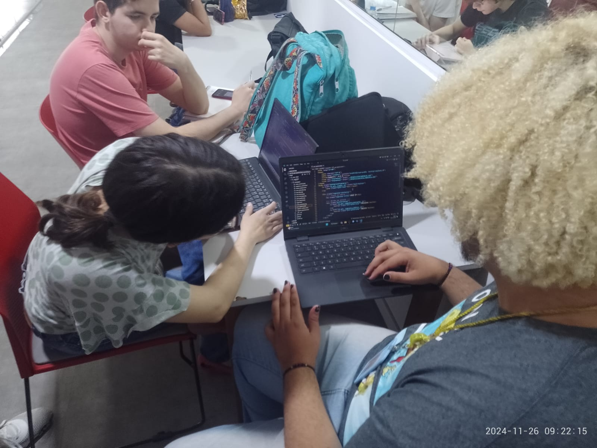
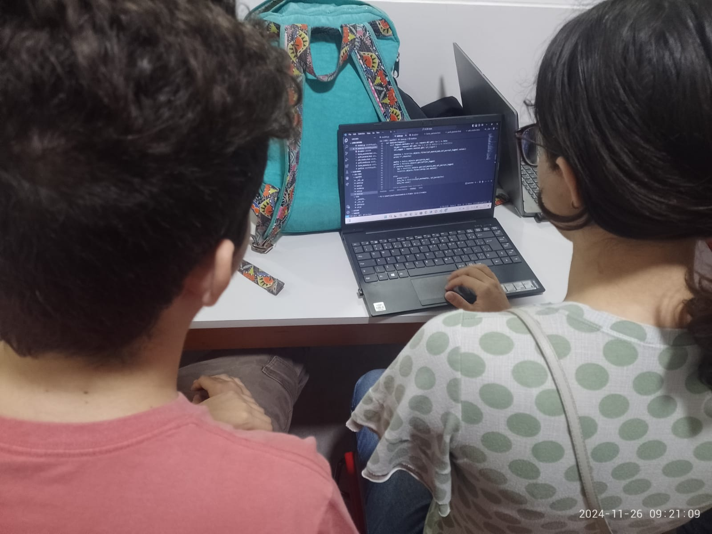
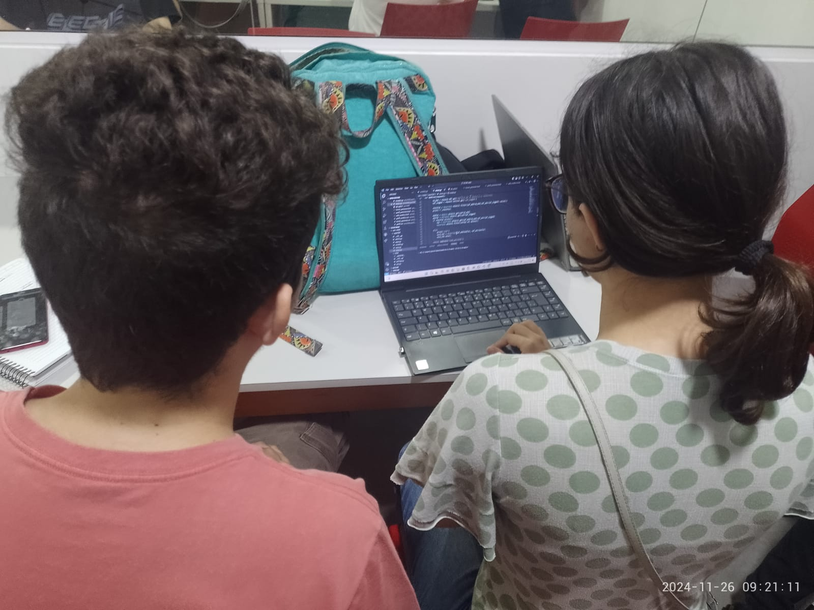

# H.E.M

## Descrição

O H.E.M é um projeto dedicado a facilitar a conexão entre pacientes e médicos. Nosso objetivo é ajudar os usuários a encontrar um médico que atenda às suas necessidades específicas, acompanhar sua evolução clínica e armazenar dados importantes sobre sua saúde. Além disso, oferecemos uma plataforma para que médicos possam ser mais reconhecidos e divulgados através do nosso sistema de avaliação.

## Tecnologias usadas

- Figma
- Jira
- Vimeo
- HTML
- CSS
- JS
- Django 

## Visualização do Projeto

As histórias do H.E.M estão sendo desenvolvidos através do JIRA. Nele, realizamos um controle dos critérios de aceitação e da implementação em um modelo protótipo no figma.

**Sprint 1 - Jira com o objetivo de criar as histórias:**

**Sprint 1 - Quadro finalizado:**

**Sprint 2 - Jira com três implementações de histórias:**
1 - Cadastro
2 - Login

- **Jira:** [Acesse o quadro de projeto aqui](https://unicap-team-slife.atlassian.net/jira/software/projects/SCRUM/boards/1)

## Screencast Figma

Clique no link abaixo para assistir ao screencast do design Figma do projeto H.E.M:

[Screencast Figma](https://vimeo.com/1008266560?share=copy)

- **Design no Figma:** [Acesse o design aqui](https://www.figma.com/design/QYBP6Imj2G5svue2oD7ptj/H.E.M?m=auto&t=DkIXqvCKssu7uQRm-6)

## Diagrama de Atividades

**Diagrama de cadastro e login:**

**Diagrama de seleção médica:**

## Programação em partes

Gabriel e Mauricio iniciaram a programa em pares. Colocando o chat de comunicaçao tanto do medico quanto do paciente, logo vc seria emcaminha para uma area de login e senha e caso nao se lembra-se da senha, vc poderia redefini-la. dessa forma, vc teria acesso a plataforma onde estaria disponivel, historico, contato e agenda medica; assim como o paciente. todo portifólio estaria a disposicao. 

## Equipe do Projeto

- Igor Gabriel
- João Carlos
- Arthur Felipe
- Maurício Henriques
- Julia Silva Souto
- Guilherme Brito
- Gabriel Bezerra
